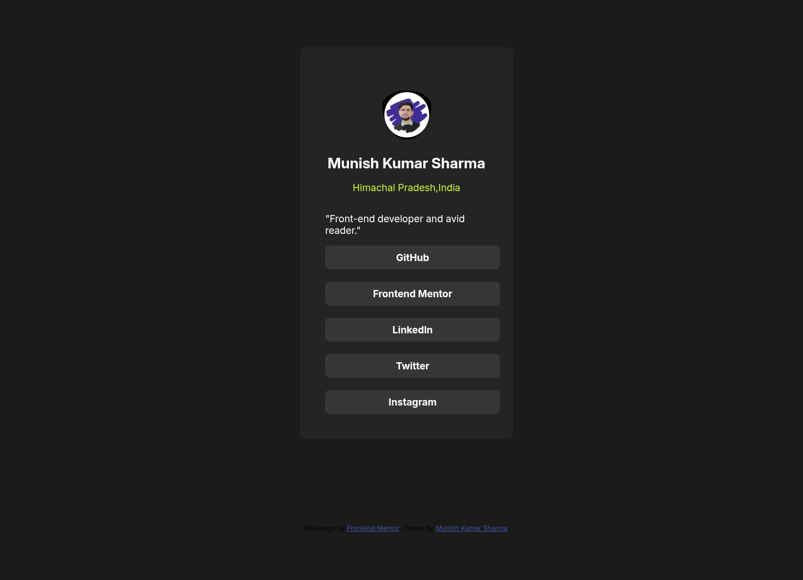

# Frontend Mentor - Social links profile solution

This is a solution to the [Social links profile challenge on Frontend Mentor](https://www.frontendmentor.io/challenges/social-links-profile-UG32l9m6dQ).

## Table of contents

- [Overview](#overview)
  - [The challenge](#the-challenge)
  - [Screenshot](#screenshot)
  - [Links](#links)
- [My process](#my-process)
  - [Built with](#built-with)
  - [What I learned](#what-i-learned)
  - [Continued development](#continued-development)
  - [Useful resources](#useful-resources)
  - [AI collaboration](#ai-collaboration)
- [Author](#author)
- [Acknowledgments](#acknowledgments)

## Overview

### The challenge

Users should be able to:

- See hover and focus states for all interactive elements on the page

### Screenshot

### Links

- Solution URL: [https://github.com/CodeWithMishu/social-links-profile-main](https://github.com/CodeWithMishu/social-links-profile-main)
- Live Site URL: [https://codewithmishu.github.io/social-links-profile-main/](https://codewithmishu.github.io/social-links-profile-main/)

## My process

### Built with

- Semantic HTML5 markup
- CSS custom properties
- Flexbox
- Mobile-first workflow
- Google Fonts

### What I learned

This project helped me practice building a responsive profile card using HTML and CSS.

I learned how to:

- structure a clean card layout with semantic HTML elements
- use flexbox to stack buttons and center content
- add hover and focus states for better interactivity
- make the layout adapt to smaller screens with responsive sizing

### Continued development

In future projects, I want to continue improving:

- responsive layout techniques for mobile and desktop
- accessible focus states and keyboard navigation
- CSS spacing and visual hierarchy

### Useful resources

- [Frontend Mentor](https://www.frontendmentor.io/) - challenge source and community support.
- [MDN Web Docs](https://developer.mozilla.org/en-US/) - reference for HTML and CSS.

### AI collaboration

I used AI guidance to help shape the layout and improve responsive styles. The goal was to ask for suggestions, then apply and verify them in the code.

## Author

- Frontend Mentor - [@CodeWithMishu](https://www.frontendmentor.io/profile/CodeWithMishu)
- Website - [https://codewithmishu.in/](https://codewithmishu.in/)

## Acknowledgments

Thanks to Frontend Mentor for the challenge and the included starter files.
